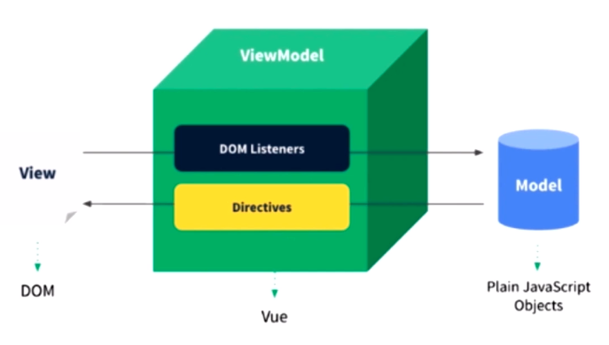
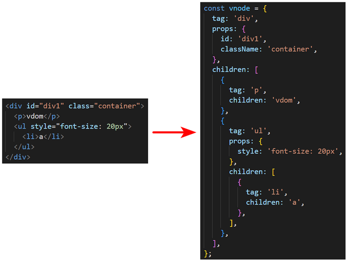

# Front-End-Interview::10-Vue

## Vue 常用的指令都有哪些？并且说明其作用

<!-- notecardId: 1704646192398 -->

🔍 所考察的知识点：Vue 指令

📢 参考答案：

| 指令                 | 描述                                                                                                                                                                   | 示例                                                           |
| -------------------- | ---------------------------------------------------------------------------------------------------------------------------------------------------------------------- | -------------------------------------------------------------- |
| **`v-model`**        | 实现**数据双向绑定**                                                                                                                                                   | `<input v-model="message">`                                    |
| **`v-for`**          | 遍历给定数据，**循环渲染元素**                                                                                                                                         | `<li v-for="item in data" :key="item.id">{{ item.name }}</li>` |
| **`v-bind`**         | **动态绑定属性** <br> 注：v-bind: 可以简写为 **:**                                                                                                                     | `<div :class="{ active: isActive }"></div>`                    |
| **`v-on`**           | **绑定事件** <br> 注：v-on: 可以简写为 **@**                                                                                                                           | `<button @click="doSomething">点击</button>`                   |
| **`v-show`**         | **条件显示** <br> 注：通过**修改样式 display 的值**来控制显示与隐藏                                                                                                    | `<p v-show="seen">显示</p>`                                    |
| **`v-if`, `v-else`** | **条件渲染** <br> 注：通过**创建和移除**来控制显示与隐藏                                                                                                               | `<p v-if="seen">创建/p><p v-else>移除</p>`                     |
| **`v-once`**         | 只渲染元素和组件**一次**                                                                                                                                               | `<p v-once>仅渲染一次</p>`                                     |
| **`v-html`**         | 将内容直接**作为普通 HTML 插入** <br> 注：1. 它会**覆盖元素内的现有内容** 2. 容易**导致 XSS 攻击**，所以只对可信内容使用 HTML 插值，**绝不要**将用户提供的内容作为插值 | `<p v-html="rawHtml"></p>`                                     |
| **`v-text`**         | 将内容**作为纯文本插入**，等同于使用插值表达式 <br> 注：它会**覆盖元素内的现有内容**                                                                                   | `<p v-text="message"></p>`                                     |

## Vue 常见的修饰符有哪些？

<!-- notecardId: 1704646192402 -->

🔍 所考察的知识点：Vue 修饰符

📢 参考答案：

修饰符**用于扩展指令的行为**，使其具有更灵活的功能

| 类型      | 修饰符         | 描述                                                                 | 示例                                                  |
| --------- | -------------- | -------------------------------------------------------------------- | ----------------------------------------------------- |
| `v-model` | **`.number`**  | 自动将用户输入内容**转换为数字**                                     | `<input v-model.number="age" type="number">`          |
|           | **`.trim`**    | 自动**去除**用户输入内容的**首尾空格**                               | `<input v-model.trim="message">`                      |
|           | **`.lazy`**    | 延迟更新绑定数据，即**当输入框失去焦点后才更新**，而是每次输入都更新 | `<input v-model.lazy="message">`                      |
| `v-on`    | **`.enter`**   | **当按下按键 enter 时**，执行处理函数                                | `<input v-on:keyup.enter="submit">`                   |
|           | **`.stop`**    | **阻止事件冒泡**                                                     | `<button v-on:click.stop="doSomething">点击</button>` |
|           | **`.prevent`** | **阻止事件的默认行为**                                               | `<form v-on:submit.prevent="onSubmit">提交</form>`    |
|           | **`.self`**    | **只有当触发事件的元素为绑定事件元素本身时**，才执行处理函数         | `<div v-on:click.self="doSomething">点击</div>`       |
|           | **`.once`**    | **事件只触发一次**                                                   | `<button v-on:click.once="doSomething">点击</button>` |
|           | **`.capture`** | 将事件监听行为**从冒泡阶段改为捕获阶段**，在捕获阶段，执行处理函数   | `<div v-on:click.capture="doSomething">点击</div>`    |

> 注：修饰符可以**链式调用**，比如：`<a v-on:click.stop.prevent="doSomething">点击</a>`

## v-if 和 v-show 的区别？

<!-- notecardId: 1704646192407 -->

🔍 所考察的知识点：Vue 指令

📢 参考答案：

v-if 和 v-show **都是用来显示和隐藏元素**，但是它们在**实现原理**和**应用场景**上有些不同，具体如下：

|          | v-if                                                                                                   | v-show                                                                             |
| -------- | ------------------------------------------------------------------------------------------------------ | ---------------------------------------------------------------------------------- |
| 实现原理 | 通过**创建和移除**来控制显示与隐藏，被隐藏元素**不存在**于 HTML 结构中                                 | 通过**修改样式 display 的值**来控制显示与隐藏，被隐藏元素**存在**于 HTML 结构中    |
| 应用场景 | 当**不需要频繁切换**显示与隐藏元素时，比如：用户未登录时的提示「立即登录」元素，登录后，直接移除该元素 | 当**需要频繁切换**显示与隐藏元素时，比如：鼠标经过/离开导航栏，显示/隐藏子菜单元素 |

## 请介绍一下计算属性 computed

<!-- notecardId: 1704729974085 -->

🔍 所考察的知识点：计算属性

📢 参考答案：

### 作用

- **依赖现有数据，自动计算结果**，且只有当数据发生变化时，才自动重新计算结果

### 为什么要使用计算属性

1. **避免插值表达式变臃肿**

   - 若直接使用**一串复杂逻辑的表达式**作为插值表达式，则会**显得非常臃肿**，难以维护

     ```html
     <!-- 目标：统计求和，求得礼物总数 -->
     <p>礼物总数：{{list.reduce((sum, item) => sum + item.num, 0)}}个</p>
     ```

     而使用计算属性，则可以将一串复杂逻辑的表达式封装到自定义的函数里，使用时，**直接使用 `{{ 计算属性名 }}` 显示数据**

2. **减少性能开销**
   - 计算属性具有**缓存特性**，若所依赖的数据未发生改变，则不会重新计算，而是直接使用缓存

### 与 methods 的区别

- 虽然也可以在配置属性 **methods** 中，声明一个函数来封装一串复杂逻辑的表达式，然后使用 **`{{方法名()}}`** 来显示处理的结果，但是这种方式是**不会缓存计算结果**，即使所依赖的数据没有变化，也会重新计算，而**计算属性具有缓存特性**，且只有当所依赖的数据发生变化时，才会重新计算结果

### 语法格式

1. 只可获取计算属性

   ```javascript
   computed: {

     计算属性名 () {
       // 计算逻辑代码
       return 结果
     }

   }
   ```

2. 既可获取也可修改计算属性

   ```javascript
   computed: {

     计算属性名: {
       get () {
         // 计算逻辑代码
         return 结果
       },
       set (修改值) {
         // 修改逻辑代码
       }
     }

   }
   ```

   > 注：当计算属性**被赋值**了，会**自动调用**其内的 **set()** 方法，并将所赋的值**传递给** set 方法的**形参**

### 使用步骤

1. 在配置属性 computed 内，**声明一个计算属性对应的函数**，在该函数内编写相关计算代码
2. 直接使用 **`{{ 计算属性名 }}`** 显示数据

   ```html
   <!DOCTYPE html>
   <html lang="en">
     <head>
       <meta charset="UTF-8" />
       <meta name="viewport" content="width=device-width, initial-scale=1.0" />
       <title>Vue Computed Property Example</title>
       <script src="https://cdn.jsdelivr.net/npm/vue@2"></script>
     </head>
     <body>
       <div id="app">
         <!-- 显示折扣后的价格 -->
         <p>折扣后价格: {{ discountedPrice }} 元</p>
       </div>

       <script>
         new Vue({
           el: '#app',
           data: {
             price: 100, // 原始价格
             discount: 0.1, // 折扣比例
           },
           computed: {
             // 计算属性，根据原始价格和折扣计算折扣后的价格
             discountedPrice() {
               return this.price * (1 - this.discount);
             },
           },
         });
       </script>
     </body>
   </html>
   ```

## 请介绍一下侦听器 watch

<!-- notecardId: 1704729974093 -->

🔍 所考察的知识点：侦听器

📢 参考答案：

### 作用

- **监听数据变化**，一旦所监听的数据发生改变，就自动调用侦听属性所对应的方法

### 何时使用

- 当需要在数据变化时，执行**异步操作**（如网络请求）或执行**开销较大的操作**时

### 语法格式

1. **监听简单数据类型的属性**

   ```javascript
   watch: {
     // 监听首层简单数据类型的属性
     属性名 (newValue, oldValue) {
       // 处理逻辑
     },
     // 监听深层简单数据类型的属性
     '对象名.属性名' (newValue, oldValue) {
       // 处理逻辑
     },
   }
   ```

   > 注：监听深层简单数据类型的属性时，必须用**引号包裹**

2. **监听复杂数据类型的属性**

   ```javascript
   watch: {
     // 监听整个对象
     对象名: {
       handler (newValue) {
         // 处理逻辑
       },
       deep: true, // 深度监听，会监听对象内部属性的变化
     },
   }
   ```

   > 注：
   >
   > 1. 方法名**必须叫 handler，不能自定义**
   > 2. 只有 newValue，**拿不到 oldValue**，因为引用类型修改内容不会改变引用地址
   > 3. 若想在监听开启之后（初始化时），**立即执行一次 handler 方法**，则需要添加 **`immediate: true`**

## 请介绍一下 Vue 中的样式操作

<!-- notecardId: 1704729974096 -->

🔍 所考察的知识点：样式操作

📢 参考答案：

Vue 框架中，可以**使用动态绑定属性的方式**来进行样式操作

1. **行内样式操作**

   - 语法格式

     ```javascript
     :style="{ 样式属性1: 属性值, 样式属性2: 属性值, ... }"
     // 或者
     :style="样式对象"
     ```

     > 注：样式属性**少**，用**第一种**语法，样式属性**多**，用**第二种**语法

   - 何时使用

     - 只是修改元素的某些具体样式属性，**不需要切换类名或者添加多个类名时**

   - 示例代码

     ```html
     <template>
       <!-- 样式属性少时 -->
       <div :style="{ color: textColor }">Hello World!</div>
     </template>

     <script>
       export default {
         data() {
           return {
             textColor: 'red',
           };
         },
       };
     </script>
     ```

     ```html
     <template>
       <!-- 样式属性多时 -->
       <div :style="styleObject">Hello World!</div>
     </template>

     <script>
       export default {
         data() {
           return {
             // 样式对象
             styleObject: {
               color: 'red',
               fontSize: '16px',
               backgroundColor: '#ccc',
             },
           };
         },
       };
     </script>
     ```

2. **类名样式操作**

   - 语法格式

     ```javascript
     :class="{ 类名1: 布尔值/表达式, 类名2: 布尔值/表达式, ... }"
     // 或者
     :class="[ '类名1', '类名2', ... ]"
     ```

     > 注：**切换类名**，用**第一种**语法，**添加多个类名**，用**第二种**语法

   - 何时使用

     - 当需要**切换类名**或者**添加多个类名**时

   - 示例代码

     ```html
     <template>
       <!-- 切换类名时 -->
       <div :class="{ active: isActive, 'text-bold': isBold }">
         Hello World!
       </div>
     </template>

     <script>
       export default {
         data() {
           return {
             isActive: true,
             isBold: false,
           };
         },
       };
     </script>
     ```

     ```html
     <template>
       <!-- 添加多个类名 -->
       <div :class="['active', 'text-bold']">Hello World!</div>
     </template>

     <script>
       export default {
         data() {
           return {};
         },
       };
     </script>
     ```

## 请介绍一下 v-for 指令

<!-- notecardId: 1704729974100 -->

🔍 所考察的知识点：v-for 指令

📢 参考答案：

### 作用

- 用于**渲染列表**，通过遍历指定的数据，搭配插值，**重复生成**多个插值**内容不同**的**列表项**

### 可遍历的数据类型

- **数组、对象和整数**

### 语法格式

1. **数组**

   ```javascript
   v-for="(item, index) in 数组"
   ```

   > 注：参数 item 为**数组元素**，index 为**数组索引**

2. **对象**

   ```javascript
   v-for="(value, key, index) in 对象"
   ```

   > 注：参数 value 为**对象属性值**，key 为**对象属性**，index 为**当前项的位置**

3. **整数**

   ```javascript
   v-for="n in 整数"
   ```

   > 注：参数 n 取值为 **[1, 整数]**，而**不是从 0 开始**

### 常搭配的属性 key

- 作用

  - 为每个列表项绑定一个**唯一的标识**，便于 Vue 跟踪每个列表项

- 语法格式

  ```javascript
  :key="值"
  ```

  > 注：key 的值必须是**字符串或者数字**，且**唯一**，不重复，但是**不能是随机数或者索引**

### 示例代码

1. **数组**

   ```html
   <template>
     <div v-for="(item, index) in items" :key="item.id">
       {{ index }} - {{ item }}
     </div>
   </template>
   ```

2. **对象**

   ```html
   <template>
     <div v-for="(value, key, index) in object" :key="index">
       {{ index }} - {{ key }}: {{ value }}
     </div>
   </template>
   ```

3. **整数**

   ```html
   <template>
     <div v-for="n in 10" :key="n">{{ n }}</div>
   </template>
   ```

## v-for 和 v-if 为什么不能一起使用？

<!-- notecardId: 1704768620659 -->

🔍 所考察的知识点：指令的使用细节

📢 参考答案：

若放在一起使用会**增加性能开销，影响渲染效率**

之所以这样，是因为 **v-for 比 v-if 优先级高**，当它们放在同一个元素上一起使用时，v-for 会先执行，然后才是 v-if。**这意味着即使 v-if 条件为假，Vue 也会先遍历整个列表，然后对每个元素执行 v-if 判断，这会造成不必要的性能开销**

## 事件触发时，如何传递 event 参数和自定义参数

<!-- notecardId: 1704768620663 -->

🔍 所考察的知识点：事件参数传递

📢 参考答案：

1. **不传递自定义参数**

   ```html
   <template>
     <div>
       <p>{{ num }}</p>
       <button @click="increment">加1</button>
     </div>
   </template>

   <script>
     export default {
       data() {
         return {
           num: 0,
         };
       },
       methods: {
         increment(event) {
           // 默认传递事件参数，使用自定义形参 event 接受
           const target = event.target;
           this.num++;
         },
       },
     };
   </script>
   ```

2. **传递自定义参数**

   ```html
   <template>
     <div>
       <p>{{ num }}</p>
       <button @click="increment(2)">加2</button>
     </div>
   </template>

   <script>
     export default {
       data() {
         return {
           num: 0,
         };
       },
       methods: {
         increment(value) {
           // 使用自定义形参 value 接受传入的参数
           this.num = this.num + value;
         },
       },
     };
   </script>
   ```

3. **既传递自定义参数，也传递 event 参数**

   ```html
   <template>
     <div>
       <p>{{ num }}</p>
       <!-- $ 符号不要漏了 -->
       <button @click="increment(3, $event)">加3</button>
     </div>
   </template>

   <script>
     export default {
       data() {
         return {
           num: 0,
         };
       },
       methods: {
         increment(value, event) {
           // 使用自定义形参 event 接受传递事件参数
           const target = event.target;
           // 使用自定义形参 value 接受传入的参数
           this.num = this.num + value;
         },
       },
     };
   </script>
   ```

## Vue 框架中，事件触发时，事件对象是什么，以及事件被绑定到哪里？

<!-- notecardId: 1704768620666 -->

🔍 所考察的知识点：对事件的深度理解

📢 参考答案：

### 事件对象是什么

- 事件对象是 JavaScript 的**原生事件对象**，例如：鼠标事件对象（**MouseEvent**）、键盘事件对象（**KeyboardEvent**）、触摸事件对象（**TouchEvent**）

### 事件被绑定到哪里

- 事件被绑定到**绑定事件的元素**，例如：事件代理中，事件被绑定到父元素，则父元素就是事件被绑定的位置，总之，事件被添加到哪个元素，就表示事件被绑定到哪个元素，使用 **event.currentTarget 或者 this** 可以获取绑定事件的元素
  > 注：event.target 是**获取触发事件的元素**，而**不是**获取绑定事件的元素

## 请介绍一下组件通信

<!-- notecardId: 1704814900114 -->

🔍 所考察的知识点：组件通信

📢 参考答案：

1. **父子通信**

   - 父传子

     1. 在父组件内，给子组件标签**添加自定义属性**，并**将要传递的数据动态赋值给该属性**
     2. 在子组件 export default 对象内，**使用 props 属性来接收**，其值为一个包含自定义的属性名的**数组或者对象**（若要校验数据类型，则取值为对象）
     3. 在子组件的 template 标签内使用 props 属性接收到的值
        

   - 子传父

     1. 在子组件的 methods 属性下，定义事件处理函数，在其内**使用 $emit() 方法触发自定义事件，并携带要传递给父组件的值**
     2. 在父组件中的子组件标签内**监听该自定义事件**
     3. 当父组件监听到子组件触发的自定义事件后，**调用对应的事件处理函数**进行处理
        

        > 注：
        >
        > 1. $emit() 方法的语法格式为 `VueComponent组件实例对象.$emit('自定义事件名', [携带参数])`，其中 携带参数为**可选**，表示要传递给父组件的值，**该值会自动传给父组件内监听该自定义事件的处理函数的形参**，比如：上图中 $emit() 方法携带的'传智教育'会自动传递给监听自定义事件 modifyTitle 的处理函数 handleChange 的形参 value 中

2. **兄弟通信**

   1. 在 utils 文件夹内，创建 EventBus.js 文件，并在其内**创建一个空 Vue 实例对象，并导出**

      ```javascript
        import Vue from 'vue
        const Bus = new Vue()
        export default Bus
      ```

   2. 在接收方组件，导入 EventBus.js 文件，并使用 **`Bus.$on('自定义事件名', 事件处理函数)`**，**监听自定义事件**

      ```javascript
      Bus.$on('sendMsg', (msg) => {
        this.msg = msg;
      });
      ```

   3. 在发送方组件，导入 EventBus.js 文件，并使用 **`Bus.$emit('自定义事件名', 要传递的值)`**，**触发自定义事件**，将值传递给接收方

      ```javascript
      Bus.$emit('sendMsg', '这是一个消息');
      ```

3. **跨层级通信**

   - 定义
     - 指的是不依次传递数据，直接**越级传递**，比如：爷传孙
   - 步骤

     1. 在祖先组件内的 export default 内，使用 **provide() 函数**来提供数据

        ```javascript
        export default {
          provide() {
            return {
              //普通类型【非响应式】
              color: this.color,
              //复杂类型【响应式】
              userInfo: this.userInfo,
            };
          },
        };
        ```

        > 注：**只有**祖先组件内 provide()函数提供的数据类型为**复杂数据**，后代组件 inject 属性接收的数据才能**随着祖先组件的更新而自动更新**，若为**简单数据**，则**不会自动更新**

     2. 在后代组件内的 export default 内，使用 **inject 属性**来接收数据

        ```javascript
        export default {
          inject: ['color', 'userInfo'],
          created() {
            console.log(this.color, this.userInfo);
          },
        };
        ```

## 请介绍一下生命周期

<!-- notecardId: 1704814900121 -->

🔍 所考察的知识点：生命周期

📢 参考答案：

### 定义

- 指的是 Vue 实例化对象**从创建到销毁**的整个过程

### 四个阶段

- **创建阶段**、**挂载阶段**、**更新阶段**、**销毁阶段**

### 钩子函数

- 定义

  - 指的是**挂载到生命周期不同阶段**上的 **Vue 内置函数**，当经历到特定阶段，会**自动调用执行**

- 作用
  - 方便开发者在生命周期的不同阶段运行**自定义代码**
- 分类
  - 生命周期上总共提供了**8 个钩子函数**，具体钩子函数名及位置示意图如下：
    

### 书写位置

- 与数据属性 data、方法 methods 等同级

## vue 生命周期中，钩子函数 mounted 和 created 的区别是什么？

<!-- notecardId: 1704814900126 -->

🔍 所考察的知识点：钩子函数

📢 参考答案：

- mounted 阶段 **DOM 元素已经创建完成**，而 created 阶段只是创建了组件实例，**DOM 元素还没有被创建**
- mounted 阶段一般**进行一些 DOM 操作**以及**发起 ajax 请求获取初始化数据**，而 created 阶段一般会进行**初始化数据**以及**设置事件监听器**

## 多组件（父子组件）中生命周期的调用顺序说一下

<!-- notecardId: 1704814900129 -->

🔍 所考察的知识点：钩子函数

📢 参考答案：

1. 加载渲染过程：父 beforeCreate-> 父 created-> 父 beforeMount-> 子 beforeCreate-> 子 created-> 子 beforeMount- > **子** mounted-> **父** mounted
2. 更新过程：**父** beforeUpdate-> 子 beforeUpdate-> 子 updated-> **父** updated
3. 销毁过程：**父** beforeDestroy-> 子 beforeDestroy-> 子 destroyed-> **父** destroyed
   > 注：挂载、更新、销毁都是等子组件先完成，之后父组件才能说自己也完成

## 如何简化父子通信的写法

<!-- notecardId: 1704814900133 -->

🔍 所考察的知识点：v-model 的使用

📢 参考答案：

实际开发中，可以通过 v-model 来简化父子通信的写法

### 简化前

- 父组件

  ```html
  <template>
    <div>
      <!-- 向子组件传递数据 data，以及监听自定义事件 upadate -->
      <ChildComponent :data="content" @update="updateContent" />
    </div>
  </template>

  <script>
    import ChildComponent from './ChildComponent.vue';

    export default {
      components: {
        ChildComponent,
      },
      data() {
        return {
          content: '',
        };
      },
      methods: {
        updateContent(newValue) {
          this.content = newValue;
        },
      },
    };
  </script>
  ```

- 子组件

  ```html
  <template>
    <div>
      <input :value="data" @input="updateValue($event.target.value)" />
    </div>
  </template>

  <script>
    export default {
      props: {
        // 接受父组件传来的数据
        data: String,
      },
      methods: {
        updateValue(newValue) {
          // 触发自定义事件，并传递数据给父组件
          this.$emit('update', newValue);
        },
      },
    };
  </script>
  ```

### 简化后

1. 方法一：不使用 model 对象

   - 父组件

     ```html
     <template>
       <div>
         <!-- 向子组件传递数据 data，以及监听自定义事件 upadate -->
         <!-- <ChildComponent :data="content" @update="updateContent" /> -->
         <ChildComponent v-model="content" />
       </div>
     </template>

     <script>
       import ChildComponent from './ChildComponent.vue';

       export default {
         components: {
           ChildComponent,
         },
         data() {
           return {
             content: '',
           };
         },
         // methods: {
         //   updateContent(newValue) {
         //     this.content = newValue;
         //   }
         // }
       };
     </script>
     ```

   - 子组件

     ```html
     <template>
       <div>
         <!-- <input :value="data" @input="updateValue($event.target.value)" /> -->
         <input :value="value" @input="updateValue($event.target.value)" />
       </div>
     </template>

     <script>
       export default {
         props: {
           // 接受父组件传来的数据
           // data: String
           value: String,
         },
         methods: {
           updateValue(newValue) {
             // 触发自定义事件，并传递数据给父组件
             // this.$emit('update', newValue);
             this.$emit('input', newValue);
           },
         },
       };
     </script>
     ```

     > 注：该方法**无法自定义**子组件内接受数据的属性名和触发事件名

2. 方法二：使用 model 对象

   - 父组件

     ```html
     <template>
       <div>
         <!-- 向子组件传递数据 data，以及监听自定义事件 upadate -->
         <!-- <ChildComponent :data="content" @update="updateContent" /> -->
         <ChildComponent v-model="content" />
       </div>
     </template>

     <script>
       import ChildComponent from './ChildComponent.vue';

       export default {
         components: {
           ChildComponent,
         },
         data() {
           return {
             content: '',
           };
         },
         // methods: {
         //   updateContent(newValue) {
         //     this.content = newValue;
         //   }
         // }
       };
     </script>
     ```

   - 子组件

     ```html
     <template>
       <div>
         <!-- <input :value="data" @input="updateValue($event.target.value)" /> -->
         <!-- <input :value="value" @input="updateValue($event.target.value)" /> -->
         <input :value="data" @input="updateValue($event.target.value)" />
       </div>
     </template>

     <script>
       export default {
         // 通过 model 对象来配置自定义数据属性名和触发事件名
         model: {
           prop: 'data',
           event: 'update',
         },
         props: {
           // 接受父组件传来的数据
           // data: String
           // value: String
           data: String,
         },
         methods: {
           updateValue(newValue) {
             // 触发自定义事件，并传递数据给父组件
             // this.$emit('update', newValue);
             // this.$emit('input', newValue);
             this.$emit('update', newValue);
           },
         },
       };
     </script>
     ```

     > 注：该方法可以**自定义**子组件内接受数据的属性名和触发事件名

## 请介绍一下 $nextTick() 方法

<!-- notecardId: 1704903445060 -->

🔍 所考察的知识点：Vue 高级特性

📢 参考答案：

### 作用

- **延迟**代码的执行时间直至**下次** DOM 更新完成后，再**立即**执行

### 语法格式

```javascript
this.$nextTick(() => {
  // 需要等待下次 DOM 更新，再执行的代码
});
```

### 何时使用

- 当**修改数据后**，要**进行相关 DOM 操作**时

### 实际场景

- 例如：你上一句代码更改了 input 输入框的显示状态，从隐藏更改为显示，然后下一句代码获取该元素调用 focus() 方法自动聚焦

  ```html
  <input ref="inp" v-if="isShow" />
  ```

  ```javascript
  this.isShow = true; // 显示输入框
  this.$refs.inp.focus(); // 获取输入框焦点
  ```

  由于 Vue 是采用**异步更新渲染页面**的，即等待全部数据修改完成后，再统一更新渲染页面，而**不是每执行一行修改数据的代码就马上更新渲染页面**，所以当执行代码 `this.isShow = true` 后，没有马上更新渲染对应的 input 的元素，即此时页面没有该 input 元素，从而导致代码 `this.$refs.inp` **获取元素的结果为 undefined**
  而将代码 `this.$refs.inp` 放入 $nextTick() 方法的回调函数中，就可以延迟该代码的执行时间，**等 input 元素渲染后，立即执行**

  ```javascript
  this.isShow = true; // 显示输入框

  this.$nextTick(() => {
    this.$refs.inp.focus(); // 获取输入框焦点
  });
  ```

  > 注：
  >
  > 1. 之所以不使用 setTimeout()方法来延迟代码执行，是因为你**无法知道下次渲染更新得多久**，就无法设置延迟的具体时间
  > 2. 之所以不使用 mounted() 方法来解决，是因为该方法是**首次加载页面后**，在生命周期的挂载阶段执行，且**只执行一次**，而修改数据是在生命周期的更新阶段

## 请介绍一下 slot

<!-- notecardId: 1704903445069 -->

🔍 所考察的知识点：Vue 高级特性

📢 参考答案：

### 作用

- 允许父组件往子组件内添加内容，实现子组件内部结构的**自定义**

### 为什么需要 slot

- **当组件的结构一致，只是部分内容不同时**，若重新再封装成一个组件，就显得有点麻烦，且没有必要，为此，我们希望不同部分不要写死，那么可以在使用组件时，**通过插槽来自定义这部分不同的内容**
  

### 原理

- 本质上就是将组件中那些不同的部分使用 `<slot>` 标签进行**占位**，在使用组件时，再传递自定义结构**替换** `<slot>` 标签

### 分类

1. **默认插槽**

   - 定义
     - 指的是**没有使用 name 属性**进行命名的 slot 标签
   - 何时使用
     - 当组件当中，**只有一处**需要自定义结构时
   - 使用步骤
     1. 在子组件内，**将需要定制的结构部分改用插槽标签** `<slot></slot>` 进行占位
     2. 在父组件内使用组件时，**提供用于替换插槽的自定义结构**
        
        > 注：
        >
        > 1. 所提供的自定义结构不单单可以放置**文本内容**，还可以放置**任何 HTML 结构**
        > 2. 若**不提供**自定义结构，则默认插槽会**空白显示**
        > 3. 若想给插槽**设置默认内容**，则直接在子组件的插槽标签内添加即可，如 **`<slot>默认内容</slot>`**

2. **具名插槽**

   - 定义
     - 指的是**使用 name 属性**进行命名的 slot 标签
   - 何时使用
     - 当组件当中，**多处**需要自定义结构时
   - 使用步骤
     1. 在子组件内，为插槽标签 `<slot></slot>` **添加 name 属性**，格式为 `name: 自定义插槽名`，来区分不同的插槽标签
     2. 在父组件内使用组件时，**使用 `<template>` 标签包裹所提供的自定义结构**，并**添加指令 `v-slot` 来指定**该自定义结构要替换哪个插槽标签
        
        > 注：`v-slot` 指令可以简写为 **#**

3. **作用域插槽**

   - 作用
     - **向父组件传递数据**，即将子组件内插槽所绑定的数据传递给父组件使用
   - 为什么需要作用域插槽
     - 由于插槽的实际内容是父组件所提供的自定义结构，因此，这部分结构只能访问父组件内的数据，**无法访问子组件内的数据**，若要实现访问，就需要使用作用域插槽
   - 何时使用
     - 父组件**要使用子组件内的数据**时
   - 使用步骤
     1. 在插槽标签 `<slot></slot>` 内，**将要传递的子组件数据赋值给所添加的自定义属性**
     2. 在父组件内使用组件时，在 `<template>` 标签处使用 `v-slot` 指令来**接受所传递的子组件数据**，格式为 **`#自定义插槽名="自定义变量名"`**
        
        > 注：
        >
        > 1. 若使用**默认插槽**，其**插槽名为 default**
        > 2. 接受数据也可以使用**解构赋值**的方式，如上图中可以直接使用 `#default="{id}"` 来解构出 id

## 请介绍一下异步加载组件（路由懒加载）

<!-- notecardId: 1704903445072 -->

🔍 所考察的知识点：性能优化

📢 参考答案：

### 定义

- 指的是在单页面程序开发中，**按需加载组件**，而不是一次性全部加载

### 为什么需要异步加载组件

- 实际开发中，需要将较大的组件和与首页加载无关的组件配置为异步组件，即什么时候访问，什么时候加载，这样可以**避免组件较大或者较多时所导致的首页加载速度慢的问题**

### 实现方法

- **修改组件的默认导入语法**，改写前后对比如下：
  

## 请介绍一下 keep-alive

<!-- notecardId: 1704903445076 -->

🔍 所考察的知识点：性能优化

📢 参考答案：

### 定义

- `<keep-alive>` 是 Vue 所提供的一个**内置组件**

### 作用

- **缓存组件**

### 为什么需要 keep-alive

1. 在**多组件频繁切换时**，**避免重新加载渲染 DOM**，从而减少性能消耗、提高用户体验性
2. **保留被切换出去的组件状态**，如位置、内容等等
   > 注：默认情况下，一个组件**在被切换出去后会被立即销毁**，从而导致它**丢失其中所有已变化的状态**，如位置、内容等等，当这个组件**再一次被显示时**，会**重新创建和渲染**

### 实际场景

- 例如：实际开发中，我们希望**从当前组件后退到上一个组件时，能够回到上一个组件跳转前的位置**
  

### 三个属性

1. include：用于缓存**所指定的组件**
2. exclude：用于缓存除了指定组件之外的**其余组件**
3. max：用于指定**最多**可以缓存多少个组件，常用 exclude 属性搭配使用

### 新增钩子函数

- 被缓存的组件会新增两个钩子函数
  1. **activated**：当组件**被激活时触发**，即切换到该组件时触发
  2. **deactivated**：当组件**失活时触发**，即离开该组件时触发
     > 注：被缓存的组件**无法再触发**以下钩子函数：**created、mounted、destroyed**

### 使用步骤

- 缓存单个组件

  ```html
  <keep-alive>
    <your-component></your-component>
  </keep-alive>
  ```

- 缓存某个路由组件

  ```html
  <!-- 只有路由组件 HomeComponent 会被缓存 -->
  <keep-alive :include="[ 'HomeComponent' ]">
    <router-view></router-view>
  </keep-alive>
  ```

## 请介绍一下 mixins

<!-- notecardId: 1704903445081 -->

🔍 所考察的知识点：Vue 高级特性

📢 参考答案：

### 定义

- 指的是将所定义的属性/方法**混入**目标组件内

### 作用

- 将**多个组件**内的**相同逻辑**抽离出来，实现多个组件可以**复用**

### 使用步骤

1. 在 src→mixins 文件夹内，**新建**一个自定义名称的 js 文件
2. 在新建的 js 文件中，**定义**属性和方法，并使用 export default 全部**导出**

```javascript
export default {
  data() {
    return {
      city: '北京',
    };
  },
  methods: {
    showName() {
      console.log(this.name);
    },
  },
  mounted() {
    console.log('mixin mounted', this.name);
  },
};
```

3. 在目标组件内**导入**该文件，并在 export default 内**添加属性 mixins**，使用**数组存放**所导入的文件

```html
<template>
  <div>
    <p>{{name}} {{major}} {{city}}</p>
    <button @click="showName">显示姓名</button>
  </div>
</template>

<script>
  // 导入文件
  import myMixin from './mixin';

  export default {
    mixins: [myMixin], // 可以添加多个，会自动合并起来
    data() {
      return {
        name: '张三',
        major: 'web 前端',
      };
    },
    methods: {},
    mounted() {
      console.log('component mounted', this.name);
    },
  };
</script>
```

### 存在的问题

1. **变量来源不明确，不利于阅读**
   > 注：由于使用了 mixins 技术，所以导致目标组件内会出现一些当前组件内**未定义的属性和方法**，这些属性和方法**查找起来不方便**
2. 多 mixins 可能会造成**命名冲突**
   > 注：冲突时，若为**生命周期函数**，则**不会覆盖**，一起执行；若为**非生命周期函数**，则目标组件内的同名属性/方法会**覆盖** mixins 内所定义的属性/方法
3. mixins 和组件可能出现**多对多**的关系，**复杂度较高**
   > 注：多对多指的是一个组件引用多个 mixins 文件，而一个 mixins 文件又被多个组件引用

## 请介绍一下 Vuex

<!-- notecardId: 1704903445085 -->

🔍 所考察的知识点：Vuex

📢 参考答案：

### 定义

- 指的是 Vue 提供的**第三方插件**

### 作用

- 管理**多个组件之间**用于互相通信的**公用数据**，比如：购物车数据、个人信息数据

### 为什么使用 Vuex

- 之所以需要使用 Vuex，是因为**使用之前组件通信方式**，则传递和修改数据都需要在相关组件内添加相关属性和监听自定义事件来实现，**当需要多个组件进行互相通信时，就会显得特别的繁琐**，而**使用 Vuex 将公用的数据集中化管理**，当公用数据一变化，响应式更新所有使用该公用数据的组件
  

### 何时使用

- 当**数据在多个组件中使用或者被修改**时，比如：个人信息、购物车数据

### 核心属性

1. **state**

   - 作用
     - **存储状态数据**
   - 示例代码

     ```javascript
     // 在 Vuex store 中的 state 定义
     const store = new Vuex.Store({
       state: {
         count: 0,
         user: null,
       },
     });
     ```

2. **getters**

   - 作用
     - **依赖 state 数据，自动计算结果**，且只有当数据发生变化时，才重新计算结果
   - 与 computed 的异同点
     - 相同点
       1. 都能**自动计算**并更新结果
       2. 都能**缓存**计算结果
     - 不同点
       1. getters 依赖 **state** 数据，computed 依赖 **data** 数据
       2. getters **只能获取不能设置**，computed 既可以获取，又可设置
   - 示例代码

     ```javascript
     // 在 Vuex store 中的 getters 定义
     const store = new Vuex.Store({
       state: {
         /* ... */
       },
       getters: {
         doubleCount: (state) => state.count * 2,
       },
     });
     ```

3. **mutations**

   - 作用
     - **同步**操作 state 数据
   - 示例代码

     ```javascript
     // 在 Vuex store 中的 mutations 定义
     const store = new Vuex.Store({
       state: {
         /* ... */
       },
       mutations: {
         increment(state) {
           state.count++;
         },
         setUser(state, user) {
           state.user = user;
         },
       },
     });
     ```

     ```javascript
     // 在组件内调用 commit() 方法来触发
     this.$store.commit('setUser', 'colbyzn');
     ```

4. **actions**

   - 作用
     - **异步操作** state 数据
   - 与同步操作数据的区别
     - 异步操作数据需要**先经过 actions 内的方法处理后，再将结果传递给 mutations 内的方法**，从而更新 state 内的数据
   - 示例代码
     

5. **modules**
   - 作用
     - **将 store 分割成模块**
   - 使用步骤
     1. 在 store 文件夹下**新建**一个 **modules 文件夹**，并**放置不同模块文件**
     2. 在模块内，**定义变量** state、mutations、actions、getters，并**导出**
     3. 在 store 文件夹下的 **index.js 文件内**，**导入**各自的模块，并**挂载**到 new Vuex.Store()的配置对象中 **modules 对象内**
        

### 辅助函数

1. **`mapState`**

   - `mapState` 辅助函数用于在组件中**映射** `store` 中的 **`state`**
   - 使用示例

     ```javascript
     import { mapState } from 'vuex';

     export default {
       computed: {
         // 原始写法
         // count() {
         //   return this.$store.state.count;
         // },
         ...mapState(['count']),
       },
     };
     ```

2. **`mapGetters`**

   - `mapGetters` 辅助函数用于在组件中**映射** `store` 中的 **`getters`**
   - 使用示例

     ```javascript
     import { mapGetters } from 'vuex';

     export default {
       computed: {
         // 原始写法
         // doubleCount() {
         //   return this.$store.getters.doubleCount;
         // },
         ...mapGetters(['doubleCount']),
       },
     };
     ```

3. **`mapMutations`**

   - `mapMutations` 辅助函数用于在组件中**映射** `store` 中的 **`mutations`**
   - 使用示例

     ```javascript
     import { mapMutations } from 'vuex';

     export default {
       methods: {
         // 原始写法
         // increment() {
         //   return this.$store.commit('increment');
         // },
         ...mapMutations(['increment']),
       },
     };
     ```

4. **`mapActions`**

   - `mapActions` 辅助函数用于在组件中**映射** `store` 中的 **`actions`**
   - 使用示例

     ```javascript
     import { mapActions } from 'vuex';

     export default {
       methods: {
         // 原始写法
         // login() {
         //   return this.$store.dispatch('login');
         // },
         ...mapActions(['login']),
       },
     };
     ```

   > 注：在组件内，**使用辅助函数**可以使得访问和修改 Store 仓库状态的**写法更加简单**

### 数据传递流程


## 请介绍一下 Vue Router

<!-- notecardId: 1704985276418 -->

🔍 所考察的知识点：Vue Router

📢 参考答案：

### 定义

- 指的是 Vue 官方提供的一个**路由插件**

### 作用

- 跳转访问路径时，切换显示**与之对应**的组件

### 实现原理

- 通过**建立访问路径 url 与组件的映射关系**来实现的

## Vue Router 怎么配置路由？

<!-- notecardId: 1704985276422 -->

🔍 所考察的知识点：Vue Router

📢 参考答案：

1. 终端

   - **下载 vue-router 包**，命令如下：

     ```text
      npm i vue-router
     ```

     > 注：默认下载的是**以 4 开头**给 Vue3 使用的版本，Vue2 下载需要使用 @ 来指定**以 3 开头**的版本

2. src → router → index.js

   1. **导入**

      ```javascript
      // Vue2
      import VueRouter from 'vue-router';
      ```

      ```javascript
      // Vue3
      import { createRouter } from 'vue-router';
      ```

   2. **全局注册**

      ```javascript
      // Vue2
      Vue.use(VueRouter);
      ```

      ```javascript
      // Vue3
      // 在 src → main.js 内全局注册
      ```

   3. **创建 router 实例，并配置 url 与组件的映射规则**

      ```javascript
      // Vue2
      const router = new VueRouter({
        routes: [
          // 一级路由
          { path: '/login', component: Login },
          // 二级嵌套路由
          {
            path: '/',
            component: Layout,
            redirect: '/home',
            children: [
              { path: '/home', component: Home },
              { path: '/category', component: Category },
            ],
          },
        ],
      });
      ```

      ```javascript
      // Vue3
      const router = createRouter({
        routes: [
          // 一级路由
          { path: '/login', component: Login },
          // 二级嵌套路由
          {
            path: '/',
            component: Layout,
            redirect: '/home',
            children: [
              { path: '/home', component: Home },
              { path: '/category', component: Category },
            ],
          },
        ],
      });
      ```

   4. **导出 router 实例**

      ```javascript
      export default router;
      ```

3. src → main.js

   1. **导入 router 实例**

      ```javascript
      import router from './router';
      ```

   2. **注入路由建立关联**/**全局注册**

      ```javascript
      // Vue2
      // 注入路由建立关联
      new Vue({
        router,
      }).$mount('#app');
      ```

      ```javascript
      // Vue3
      // 全局注册
      app.use(router);
      ```

4. **配置路由出口**

   ```html
   <div id="app">
     <h1>Hello App!</h1>

     <!-- 路由匹配到的组件将渲染在这里 -->
     <router-view></router-view>
   </div>
   ```

5. **配置导航链接**

   ```html
   <div id="app">
     <h1>Hello App!</h1>
     <ul>
       <!-- 使用 router-link 组件来导航. -->
       <!-- 通过传入 `to` 属性指定链接. -->
       <!-- <router-link> 默认会被渲染成一个 `<a>` 标签 -->
       <li>
         <router-link to="/home">首页</router-link>
       </li>
       <li>
         <router-link to="/category">分类页</router-link>
       </li>
     </ul>
   </div>
   ```

## 请介绍一下 Vue Router 中的路由模式，以及如何切换模式？

<!-- notecardId: 1704985276426 -->

🔍 所考察的知识点：Vue Router

📢 参考答案：

### 路由模式

- Vue Router 中有两种路由模式：**hash 模式**、**history 模式**

  1. hash 模式

     - 定义

       - 指的是 url 中路由**带 #**

     - 示例

       - <https://www.example.com/#/home>

     - 特点

       - hash 变化时，**不会刷新页面**
       - hash **不会被提交到服务器端**（与服务器端无关，只在前端自生自灭）
       - **兼容性**，不需要服务器端配置
       - **不利于搜索引擎优化**（SEO）

  2. history 模式

     - 定义

       - 指的是 url 中路由**不带 #**

     - 示例

       - <https://www.example.com/home>

     - 特点

       - 跳转时，**不刷新页面**
       - **有利于搜索引擎优化**
       - **需要服务器端进行相关配置，比如：将所有页面都配置重定向到首页路由，否则会返回 404**

  > 注：以上两种路由模式都**不会引起页面的重新加载**

### 路由模式切换

- **hash** 模式是**默认模式**，**不需要配置**，若切换到 history 模式，则需要配置

  ```javascript
  // Vue2
  const router = new VueRouter({
    mode: 'history',
    routes: [
      // 路由配置...
    ],
  });
  ```

  ```javascript
  // Vue3
  const router = createRouter({
    history: createWebHistory(),
    routes: [
      // 路由配置...
    ],
  });
  ```

## 路由配置项常用的属性及其作用

<!-- notecardId: 1704985276430 -->

🔍 所考察的知识点：Vue Router

📢 参考答案：

1. **path**：配置**跳转路径**
2. **component**：配置**与路径相映射的组件**
3. **name**：配置**路由名称**
4. **children**：配置**二级路由**，即嵌套路由
5. **redirect**：配置**路由重定向**

## 路由跳转传参的方式有哪些？

<!-- notecardId: 1704985276434 -->

🔍 所考察的知识点：

📢 参考答案：

路由跳转传参的方式有两种：**查询参数传参**、**动态路由传参**

1. 查询参数传参

   - 何时使用

     - 当需要传递**多个**参数时

   - 语法格式

     1. 声明式导航

        ```html
        <router-link to="/path?参数名1=值&参数名2=值"></router-link>
        ```

        ```html
        <a href="/path?参数名1=值&参数名2=值"></a>
        ```

     2. 编程式导航

        ```javascript
        this.$router.push('/路径?参数名1=值&参数名2=值');
        ```

        ```javascript
        this.$router.push({
          path: '/路径',
          query: {
            参数名1: '值',
            参数名2: '值',
          },
        });
        ```

        ```javascript
        this.$router.push({
          // 使用命名路由，需先在配置项 routes 内的对应路由中添加 name 属性
          // 使用命名路由跳转的好处是可以防止你在 url 中出现打字错误
          name: '路由名称',
          query: {
            参数名1: '值',
            参数名2: '值',
          },
        });
        ```

   - 获取查询参数

     - 通过 **`$route.query.参数名`** 来获取传递的查询参数

2. 动态路由传参

   - 何时使用

     - 当只传递**一个**参数时

   - 配置动态路由

     ```javascript
     const router = new VueRouter({
       routes: [
         {
           // 动态字段以冒号开始，如下方示例中的 :username
           path: '/user/:username',
           component: User,
         },
       ],
     });
     ```

   - 语法格式

     1. 声明式导航

        ```html
        <router-link to="/path/值"></router-link>
        ```

        ```html
        <a href="/path/值"></a>
        ```

     2. 编程式导航

        ```javascript
        this.$router.push('/路径/值');
        ```

        ```javascript
        this.$router.push({
          path: '/路径/值',
        });
        ```

        ```javascript
        this.$router.push({
          name: '路由名称',
          params: {
            参数名: '值',
          },
        });
        ```

   - 获取查询参数

     - 通过 **`$route.params.参数名`** 来获取传递的查询参数

## `route` 和 `router` 的区别是什么？

<!-- notecardId: 1705159171930 -->

🔍 所考察的知识点：Vue Router

📢 参考答案：

|          | `$route`                                                           | `$router`                                                        |
| -------- | ------------------------------------------------------------------ | ---------------------------------------------------------------- |
| 包含内容 | 包含了**当前路由页面信息**，比如：路径、查询参数、动态路由参数等等 | 包含了**编程式导航相关方法**，比如：push()、replace()、go() 等等 |
| 使用场景 | 主要用于在路由跳转传参时，**获取相关的路径、参数**等               | 主要用于**实现路由的跳转、前进、后退**等                         |

## 谈一谈对 MVVM 的理解？

<!-- notecardId: 1704985276443 -->

🔍 所考察的知识点：Vue 原理

📢 参考答案：

- MVVM 的全称为 **Model View ViewModel** 的缩写，其中 Model 代表**数据模型**，View 代表**视图**，而 ViewModel 是**数据模型和视图的连接桥梁**
- 在 MVVM 架构下，**View 和 Model 之间并没有直接的联系**，而是通过 ViewModel 进行交互的
- ViewModel 负责**处理 View 的逻辑**，例如响应用户的输入，**将命令发送到 Model**，并**监听 Model 的数据改变**，**反过来更新 View**
- MVVM 的**数据驱动视图**方式，使得开发者**更专注于业务逻辑的实现**，**而不是手动操作 DOM 更新视图**
- 可以将 View 类比为**顾客**，Model 类比为**后厨**，而 ViewModel 就是**服务员**
- 顾客**只需关注菜单，选择菜品**，后厨**只需关注如何做菜**，而服务员需要**接受顾客的点单**，然后**告诉后厨**需要准备什么菜品，**当菜品准备好了**，将其**送到顾客面前**
  

## 说一下对 Vue 响应式原理的理解

<!-- notecardId: 1705073225026 -->

🔍 所考察的知识点：响应式原理

📢 参考答案：

### Vue2 的响应式

#### 监听对象

- 原理

  - Vue2 实现响应式主要是依赖于 **`Object.defineProperty()`** 函数
  - 在 Vue 实例初始化时，会遍历 data 对象中的所有属性，并使用 `Object.defineProperty()` 函数**把这些属性全部转换为 getter/setter，实现数据劫持**
  - 当属性**被访问**时，使用 getter 来**收集依赖**，从而**知道哪些组件或计算属性使用了该数据**
  - 使用 setter 来**监听数据变化**，当属性**被修改**时，**通知使用该数据的组件或计算属性进行更新**

    ```javascript
    const data = {
      username: 'zhangsan',
    };

    Object.defineProperty(data, 'username', {
      get: function () {
        console.log('get');
        return username;
      },
      set: function (newValue) {
        console.log('set');
        username = newValue;
      },
    });

    // 属性被访问时，就会打印出 get
    data.username;

    // 属性被修改时，就会打印出 set
    data.username = 'lisi';
    ```

- 缺点

  1. 对于**复杂对象**进行深度监听时，需要**递归到底**，即**为所有属性递归调用 `Object.defineProperty()` 函数**，这样会造成**一次性计算量大**，当复杂对象很大时，在页面初始化时，就会卡死
  2. **无法监听**新增属性和删除的属性
     > 注：解决方法是使用 **`Vue.set()`** 方法来新增属性，使用 **`Vue.delete()`** 方法来删除属性，而不是直接使用对象的新增和删除语法，如：`obj.新属性名 = 值`、`delete obj.属性名`
  3. **无法原生监听数组**，需要另外进行特殊处理
     > 注：具体解决方法见下方「监听数组」

#### 监听数组

- 原理

  - 由于 **`Object.defineProperty()`** 函数**无法监听数组的变化**，为了解决这个问题，**Vue2 扩展了 push、pop、splice 等变异方法**，使得使用这些方法**修改数组时**，可以**触发视图更新**

    ```javascript
    // 数据
    const data = {
      nums: [10, 20, 30],
    };

    // 创建一个空对象，其原型为数组的原型对象
    const obj = Object.create(Array.prototype);

    // 在该对象上扩展变异方法，如：push、pop 等
    ['push', 'pop', 'shift', 'unshift', 'splice'].forEach((methodName) => {
      obj[methodName] = function () {
        // 调用方法时，触发视图更新
        console.log('视图更新');
        // 再调用原生的 push、pop 等方法
        // this 为调用方法的原数组，arguments 为传入的参数
        Array.prototype[methodName].call(this, ...arguments);
      };
    });

    // 将数据 data 内数组的原型指向 obj
    // 从而数组会调用 obj 内扩展的变异方法
    data.nums.__proto__ = obj;

    data.nums.push(40);
    ```

- 缺点

  1. 无法监听**利用索引直接新增或修改数组元素**的情况，例如：`items[index] = value`，因此，实际开发中，**避免这么做**

     > 注：解决方法如下：
     >
     > 1. 使用 **`Vue.set()`** 方法，例如：`Vue.set(items, index, value)`
     > 2. 使用**数组变异方法 splice()** 方法，例如：`items.splice(index, 1, value)`
     > 3. 直接使用**新数组替换旧数组**

  2. 无法监听**直接修改数组长度**的情况，例如：`items.length = newLength`，因此，实际开发中，**避免这么做**
     > 注：解决方法同上

### Vue3 的响应式

#### 原理

- Vue3 实现响应式主要依赖于 **Proxy**

#### 缺点

- Proxy 有兼容性问题，无法使用 polyfill

## 用 JS 模拟以下 DOM 结构（请用 vnode 来模拟以下 html 片段）

```html
<div id="div1" class="container">
  <p>vdom</p>
  <ul style="font-size: 20px">
    <li>a</li>
  </ul>
</div>
```

%

📢 参考答案：

```javascript
const vnode = {
  tag: 'div',
  props: {
    id: 'div1',
    className: 'container',
  },
  children: [
    {
      tag: 'p',
      children: 'vdom',
    },
    {
      tag: 'ul',
      props: {
        style: 'font-size: 20px',
      },
      children: [
        {
          tag: 'li',
          children: 'a',
        },
      ],
    },
  ],
};
```

> 注：
>
> 1. 对于**标签上的 class 属性**，js 中要使用 **className**，因为 class 是 js 内的关键字，已被占用
> 2. 不同的框架使用 JS 模拟 DOM 结构**不完全相同**，例如：定义元素，有的用 **tag** 作为属性名，有的用 **element** 作为属性名，有的会**将 style 属性放在 props 属性内**，而有的会**单独将 style 属性拎出来**

## 请介绍一下 VDOM

<!-- notecardId: 1705073225036 -->

🔍 所考察的知识点：VDOM

📢 参考答案：

### 定义

- VDOM 的英文全称为 **Virtual DOM**（虚拟 DOM），指的是**使用 JavaScript 对象的形式来模拟真实 DOM 的层次结构**
  

### 为什么需要使用 VDOM

- 之所以要使用 VDOM，是因为 **DOM 操作非常耗费性能**，要**避免没有必要的 DOM 的操作**，以减少 DOM 操作次数，而 **VDOM 存在于内存中**，并不是直接操作浏览器的 DOM，它通过**对比**新旧 VDOM 的差别，**预先计算出** DOM 操作的**最小更新范围**，再**一次性更新** DOM 操作，做到该更新的 DOM 更新，不该更新的 DOM 不更新
  > 注：之所以说 DOM 操作非常耗费性能，是因为它涉及到浏览器的**重绘**（repaint）和**回流**（reflow）

## 请介绍一下 Vue 框架中 VDOM 的 diff 算法

<!-- notecardId: 1705158331690 -->

🔍 所考察的知识点：diff 算法

📢 参考答案：

### 定义

- VDOM 的 diff 算法指的是一种用于**比较两个虚拟 DOM 树**，以**找出**它们之间**差异**的算法，它是 VDOM 的最核心、最关键的部分

### Vue2 的 diff 算法

- 遵循规则

  1. **只比较同一层级，不跨级比较**
     
  2. **若 tag 不相同，则直接删除重建，不再深度比较**
     
     > 注：如上图 D 和 G 节点不相同，即使它们的子节点完全相同，也直接删除重建
  3. **若 tag 和 key 两者都相同，则认为是相同节点，不再深度比较**
     > 注：key 指的是使用 v-for 指令时，所添加的唯一标识符 key

  > 注：若**不使用**上述规则进行优化，而是直接比较两个虚拟 DOM 树的所有内容，那么**时间复杂度是 O(n^3)**，这是一个不可用的算法，因为数据量一大，计算量会极大，比如：1000 个节点，最坏的情况要运算 10 亿次，而**使用**上述规则优化后的**时间复杂度为 O(n)**，极大降低了运算量

- 执行流程

  1. **先同级比较，再比较子节点**
  2. 比较子节点时，分为两种情况：
     1. **若一方有子节点，另一方没有子节点**，则根据具体情况，执行**添加或者移除**的操作
        > 注：例如，新的 children 有子节点，而旧的 children 没有子节点，则对旧的 children 执行移除子节点操作，反之，执行添加操作
     2. **若都有子节点**，则**进行双端比较**，即从新旧 children 的两端开始进行比较，每次循环，**进行前前、后后、前后比较，以及借助 key 在旧 children 中寻找可复用节点**
        > 注：相比于从头到尾依次比较的方法，**双端比较算法能有效减少循环的次数** > 

### Vue3 的 diff 算法

- 待补充~

## 使用 v-for 指令时，为什么要使用 key

<!-- notecardId: 1705158331701 -->

🔍 所考察的知识点：diff 算法

📢 参考答案：

首先，key 的作用是为每个列表项绑定一个**唯一的标识**，当数据发生更新后，VDOM 的 diff 算法会**基于 key 的变化，来选择重用元素或者移除元素或者重新排列元素顺序，从而实现以最小的 DOM 操作来更新列表，提高渲染性能**，示例如下：


> 注：如上图，当数据只是改变了顺序时，若**不使用 key**，则 Vue 会**删除元素重新创建**，若**使用了 key**，则**只是重新排列元素顺序**

## 请介绍一下模板编译

<!-- notecardId: 1705158331708 -->

🔍 所考察的知识点：模板编译

📢 参考答案：

### 模版的定义

- 指的是 Vue 组件内的 **`<template>`** 标签

### 模版与 html 的区别

- **模版不是 html**，因为模版有指令、插值、JS 表达式，能实现判断、循环，而这些是 html 所不具备的

### 模版编译的定义

- 指的是**将模版转换为 JavaScript 代码**

### 模版编译的过程

- 通过相关工具**将模版编译为 render 函数**

  ```html
  <!-- 模版 -->
  <template>
    <div id="div1" class="container">
      
    </div>
  </template>
  ```

  ```javascript
  // render 函数
  with (this) {
    return _c('div', { staticClass: 'container', attrs: { id: 'div1' } }, [
      _c('img', { attrs: { src: imgUrl } }),
    ]);
  }
  // 注：_c 是 Vue 中自定义的缩写函数，其全称为 createElement
  ```

  > 注：在实际项目开发中，Webpack 会使用 **vue-loader** 在**开发环境**下，进行**模版编译**，而不是等到运行到浏览器时，再开始编译，这属于性能优化的一种方法

## 描述组件渲染和更新的过程

<!-- notecardId: 1705158331714 -->

🔍 所考察的知识点：模版编译、组件渲染与更新

📢 参考答案：

### 初步渲染过程

1. 将模版**编译为 render 函数**
2. **执行 render 函数，生成 vnode**，同时会**触发**响应式数据的 **getter**，**收集依赖**
   > 注：收集依赖的目的是**_知道哪些组件或者计算属性使用了数据_**
3. 基于 vnode，再执行 **patch(element, vnode)** 进行**初次渲染**

### 更新渲染过程

1. **修改数据时**，会**触发**响应式数据的 **setter**，进而**通知** getter 所搜集的**依赖**进行**更新**
2. **重新执行 render 函数，生成新的 vnode**
3. **比较新旧 vnode**，再执行 **patch(vnode, newVnode)** 进行**更新渲染**

### 流程示意图


## 请介绍一下 Vue 组件的异步渲染

<!-- notecardId: 1705222011605 -->

🔍 所考察的知识点：异步渲染

📢 参考答案：

### 定义

- 指的是 Vue 在**更新组件时**，并**不是立即渲染**，而是**汇总 data 修改**，然后**将更新组件的异步任务放到下一轮事件循环（event loop）中统一更新**

### 好处

- 当数据 data **修改多次**，组件的**更新只会执行一次**，从而**避免了不必要的计算和 DOM 操作，提高了性能**

## Vue 路由的实现原理

<!-- notecardId: 1705222011611 -->

🔍 所考察的知识点：路由实现原理

📢 参考答案：

要实现跳转路径，切换到对应的组件，需要满足以下三个条件：

1. **跳转路径时，不刷新页面**

   - 利用 **hash 模式**和 **histroy 模式**跳转不刷新页面的特性来实现

2. **要知道何时跳转**

   - hash 模式

     - 通过为 **`location.hash`** 赋值来实现**跳转到指定路由路径**，通过 **`window.onhashchange`** 事件来**监听 hash 的变化**

       ```javascript
       // 跳转到指定路由路径
       document.getElementById('btn').addEventListener('click', () => {
         location.hash = '#/user';
       });
       ```

       ```javascript
       // 监听 hash 变化
       window.onhashchange = (event) => {
         console.log('old url', event.oldURL);
         console.log('new url', event.newURL);

         console.log('hash:', location.hash);
       };
       ```

   - history 模式

     - 通过 **`history.pushState`** 来**跳转到指定路由路径**，通过 **`window.onpopstate`** 来**监听路径的变化**

       ```javascript
       // 跳转到指定路由路径
       document.getElementById('btn').addEventListener('click', () => {
         const state = { name: 'user' };
         history.pushState(state, '', 'user');
       });
       ```

       ```javascript
       // 监听路径的变化
       window.onpopstate = (event) => {
         console.log('onpopstate', event.state, location.pathname);
       };
       ```

3. **建立跳转路径和组件的映射关系**

   - 当监听到路由路径变化时，调用对应组件显示即可

## v-model 实现双向数据绑定的原理

<!-- notecardId: 1705246475061 -->

🔍 所考察的知识点：模版编译

📢 参考答案：

1. v-model 本质是一个**语法糖**，背后是通过 **v-bind 和 v-on** 的结合来实现的
2. 通过 v-bind **将数据绑定到相应的属性上**（如 value、checked），当数据发生变化时，视图会自动更新
3. 通过 v-on **自动监听相应的输入事件**（如 input、change 等），当视图发生变化（例如用户在输入框中输入了新的值）时，**将新的值赋给数据**，从而实现双向绑定
4. **在模版编译过程中**，vue 会自动将 v-model 指令**转换为 v-bind 和 v-on 相结合的形式**，示例如下：

   ```html
   <template>
     <!-- 使用 v-model 绑定数据的 input 输入框 -->
     <input type="text" v-model="name" />
   </template>
   ```

   ```javascript
   // 编译后的 render 函数
   with (this) {
     return _c('input', {
       directives: [
         {
           name: 'model',
           rawName: 'v-model',
           // 数据 name 绑定到 value 属性上
           value: name,
           expression: 'name',
         },
       ],
       attrs: { type: 'text' },
       domProps: { value: name },
       on: {
         input: function ($event) {
           if ($event.target.composing) return;
           // 获取新的值，并赋值给数据绑定数据 name
           name = $event.target.value;
         },
       },
     });
   }
   ```

## Vue 组件内的 data 为什么必须是一个函数？

<!-- notecardId: 1705246475070 -->

📢 参考答案：

主要原因是确保每个组件实例都拥有一个**独立的数据对象**，**防止组件之间的数据共享和相互影响**

**若 data 写成对象**，则**所有**的组件实例都会**共用一份 data**，就会造成在一个组件内修改数据，其他组件内的数据也跟着变的问题
**若 data 写成一个函数**，则每次创建组件实例时，都会调用该函数，**返回一个全新的数据对象**，这样，每个组件实例都拥有独立的数据，彼此之间不会互相影响

## ajax 请求应该放在哪个生命周期？

<!-- notecardId: 1705246475076 -->

📢 参考答案：

结果：

- 发起 AJAX 请求获取数据是 **`mounted`** 阶段进行的

理由：

- 若放在 **`created` 阶段**发起 AJAX 请求，**可能不够理想**，因为此时 DOM 还未挂载，**无法确保操作的准确性**，而在 `mounted` 阶段，DOM 已经完成挂载，可以进行 DOM 操作，因此，在该阶段发起 AJAX 请求，更为合适

## 如何将组件所有 props 传递给子组件？

<!-- notecardId: 1705246475083 -->

📢 参考答案：

可以通过 **`$props`** 来实现，示例代码如下：

```html
<!-- 假如子组件为 User -->
<User v-bind="$props" />
```
